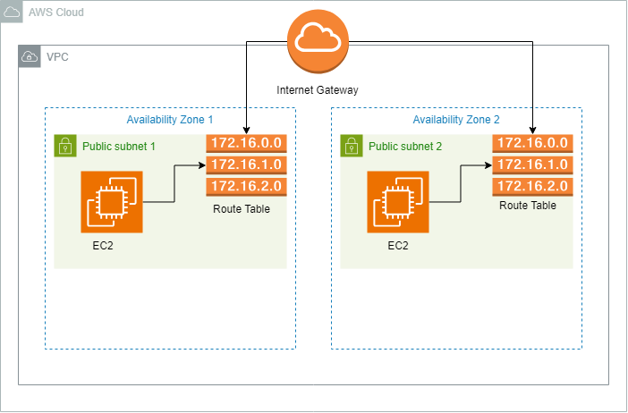
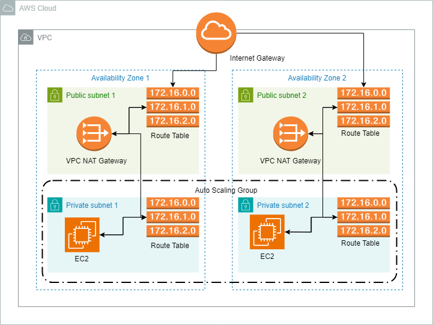

# High Availability and Scalability Demo

## This project demonstrates deploying a high availability infrastructure on AWS using Terraform.

This demonstration highlights high availability through the creation of key AWS components using Terraform: a VPC with public subnets, an Internet Gateway, and a route table. It includes setting up key pairs, security groups, a target group, EC2 instances, and an Elastic Load Balancer for efficient traffic distribution. This example performs the following steps:

1. Provision a VPC.
2. Create and attach an Internet Gateway to the VPC.
3. Set up a route table within the VPC.
4. Create two public subnets in separate availability zones within the VPC.
5. Associate both subnets with the route table.
6. Configure a security group that permits HTTP and SSH traffic for EC2 instances (EC2 Security Group).
7. Launch EC2 instances in each public subnet.
8. Associate the security group with the EC2 instances to allow HTTP and SSH traffic.
9. Establish a target group and register both EC2 instances with it.
10. Create a security group for the Elastic Load Balancer, permitting HTTP traffic.
11. Deploy the Elastic Load Balancer using Terraform.
12. Configure inbound rules to allow traffic from the Load Balancer to the EC2 Security Group.
13. Generate a key pair on AWS for accessing the EC2 instances.
14. Provision the EC2 instances using the web.sh script, which installs the __httpd__ service on Ubuntu, creates an __index.html__ file in the __var/www/html__ directory, and writes instance metadata to the __index.html__.

## Infrastructure Diagram
<p align="center">
  
</p>

## How to use this example project
* Setup AWS CLI.
* Generate keys on AWS to use with AWS CLI.
* Install terraform.

Run these commands from the root directory of the project
```bash
terraform init
terraform validate
terraform plan
terraform apply
```
## Improvements
<p align="center">
  
</p>

To enhance the security of our network, we can add private subnets and move our EC2 instances into these subnets. However, since instances in private subnets are not directly accessible from the internet, it is necessary to create a NAT Gateway to enable outbound internet access.

Utilizing auto-scaling groups to launch instances adds scalability to the network, automatically adjusting resources based on demand. This approach enhances performance, maintains availability, and optimizes cost efficiency by scaling up or down as needed.

## Find a bug
If you encounter an issue or have suggestions for improving this project, please submit an issue via the "Issues" tab above.

## Author

[Sharique Ali](https://github.com/sharique-tech1987)

